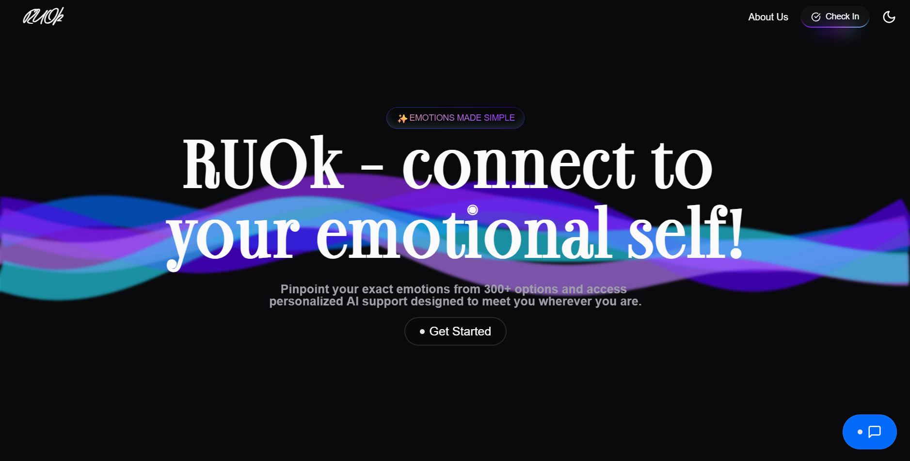

# RU-OK: Digital Mental Health Support System for Higher Education

<div align="center">


[](https://www.typescriptlang.org/)
[](https://reactjs.org/)
[](https://expressjs.com/)
[](https://opensource.org/licenses/MIT)

</div>



## Team Details 
Team Id - 63584

Members:
- Suvrat Mittal (Team Lead)
- Chehak Sharma 
- Sumit Singh Bisht
- Shubham Raj
- Lakshay Goyal 
- Tanishq Sethi

## 📋 Overview

RU-OK is a comprehensive digital mental health platform specifically designed for higher education institutions to address the growing mental health crisis among college students. Our platform provides culturally-sensitive, institution-specific psychological support through AI-guided interventions, professional counseling integration, and peer support systems.

Unlike generic Western-oriented mental health applications, RU-OK fills a critical gap with features tailored to diverse cultural contexts, multilingual support, and institution-specific customization.

## 🚀 Features

### For Students

- **Advanced Emotional Check-ins**: 300+ emotions categorized into color-coded sections
- **Personalized Wellness Toolkits**: Breathing exercises, videos, and audio content
- **AI Chatbot "Sage"**: 3D avatar support with multilingual capabilities
- **Confidential Therapist Booking**: Identity protection options
- **Encrypted Peer Forums**: AI moderation for safe community support

### For Therapists

- **Client Dashboard**: Comprehensive user data access
- **Integrated Session Management**: Note-taking capabilities
- **Tool Recommendation System**: Personalized resources for clients
- **Forum Moderation**: Professional oversight of community interactions

### For Administrators

- **Anonymous Institutional Analytics**: Data-driven insights
- **Therapist Management System**: Resource allocation optimization
- **Policy Insights**: Timestamped analytics for decision-making

## 🔒 Security

All user data is encrypted using SHA256 for maximum privacy and security. The platform emphasizes confidentiality across all interactions, with special attention to anonymous forum participation.


## 🛠️ Tech Stack

### Frontend
- React 19.1.0
- TypeScript 5.8.3
- Three.js (for 3D avatar)
- Framer Motion (animations)
- Radix UI (accessible components)

### Backend
- Express.js 4.18.2
- MongoDB with Mongoose 7.5.0
- Node.js with TypeScript
- JWT Authentication
- Google Auth integration

### AI & ML
- Google Generative AI integration
- ElevenLabs Voice AI
- GROQ SDK for language processing

## 📊 Platform Architecture

```
┌───────────────────┐    ┌────────────────────┐    ┌───────────────────┐
│  Student Portal   │    │  Therapist Portal  │    │   Admin Portal    │
└─────────┬─────────┘    └──────────┬─────────┘    └─────────┬─────────┘
          │                         │                         │
          ▼                         ▼                         ▼
┌───────────────────────────────────────────────────────────────────────┐
│                           Shared API Layer                             │
└──────────────────────────────────┬────────────────────────────────────┘
                                   │
                                   ▼
┌──────────────────────────────────────────────────────────────────────┐
│                     Authentication & Authorization                    │
└──────────────────────────────────┬───────────────────────────────────┘
                                   │
                                   ▼
┌──────────┬────────────┬──────────────┬────────────┬─────────────────┐
│ Emotional │  AI Chat  │  Counseling  │  Forums &  │  Analytics &    │
│ Tracking  │  Service  │  Management  │ Community  │  Reporting      │
└──────────┴────────────┴──────────────┴────────────┴─────────────────┘
```

## 🚀 Getting Started

### Prerequisites
- Node.js (v18 or higher)
- npm package manager
- MongoDB instance

### Installation

```bash
# Clone the repository
git clone https://github.com/iamtanishqsethi/RUOK-SIH
cd ru-ok

# Open Backend Folder 
cd backend

# Install dependencies
npm install

# Set up environment variables
touch .env
# Edit .env with your configuration

# Start development server
npm run dev

# Open Frontend Folder 
cd frontend

# Install dependencies
npm install

# Set up environment variables
touch .env
# Edit .env with your configuration

# Start development server
npm run dev
```


[//]: # (### Environment Variables)

[//]: # ()
[//]: # (Create a `.env` file with the following variables:)

[//]: # ()
[//]: # (```)

[//]: # (MONGODB_URI=your_mongodb_connection_string)

[//]: # (JWT_SECRET=your_jwt_secret)

[//]: # (GOOGLE_CLIENT_ID=your_google_client_id)

[//]: # (ELEVENLABS_API_KEY=your_elevenlabs_api_key)

[//]: # (GOOGLE_AI_API_KEY=your_google_ai_api_key)

[//]: # (CLOUDINARY_CLOUD_NAME=your_cloudinary_name)

[//]: # (CLOUDINARY_API_KEY=your_cloudinary_api_key)

[//]: # (CLOUDINARY_API_SECRET=your_cloudinary_api_secret)

[//]: # (```)


## 📝 License

This project is licensed under the MIT License - see the [LICENSE](LICENSE) file for details.

